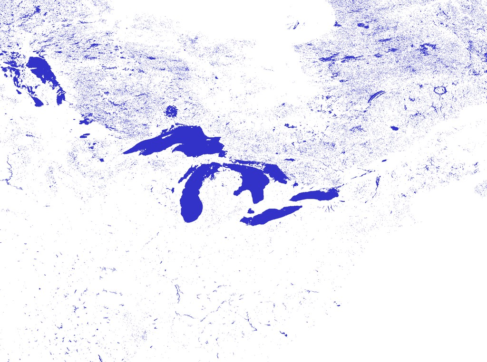

# HydroLAKES to Heightmap Converter

Convertit la base de données vectorielle HydroLAKES (1,4 million de lacs) en heightmap raster haute résolution. Gère correctement les îles dans les lacs via un algorithme hybride optimisé (scanline + ray-casting sélectif). Export en RAW, BMP ou PNG transparent 32-bit pour intégration dans des pipelines cartographiques.

Pensez a téléchager le fichier au standard shapefile sur le site de de https://www.hydrosheds.org/products/hydrolakes



## Compilation

```bash
dcc32 LakesConverter.dpr
```

## Utilisation

```bash
LakesConverter.exe convert HydroLAKES_polys_v10.shp lakes.raw lakes.png
```

## Performance

| Résolution | Temps |
|-----------|-------|
| 21600×10800 | 1h |
| 131072×65536 | 15h |

---

Développé pour le générateur de cartes du jeu de rôle **Polaris** (Black Book Éditions).
